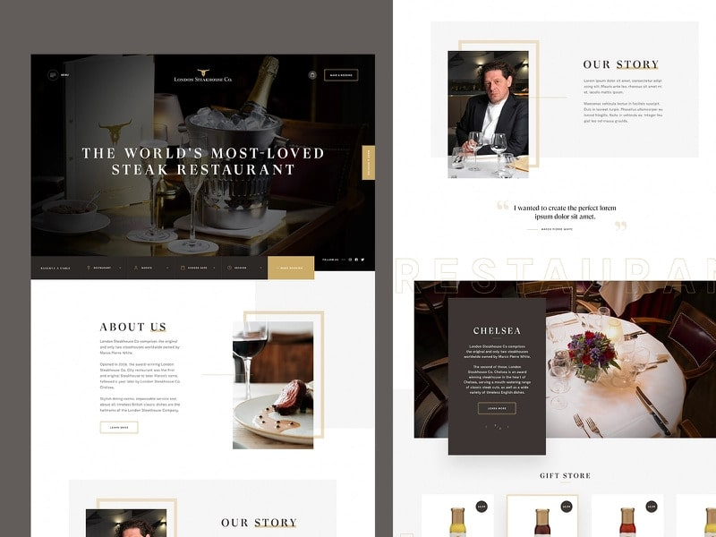
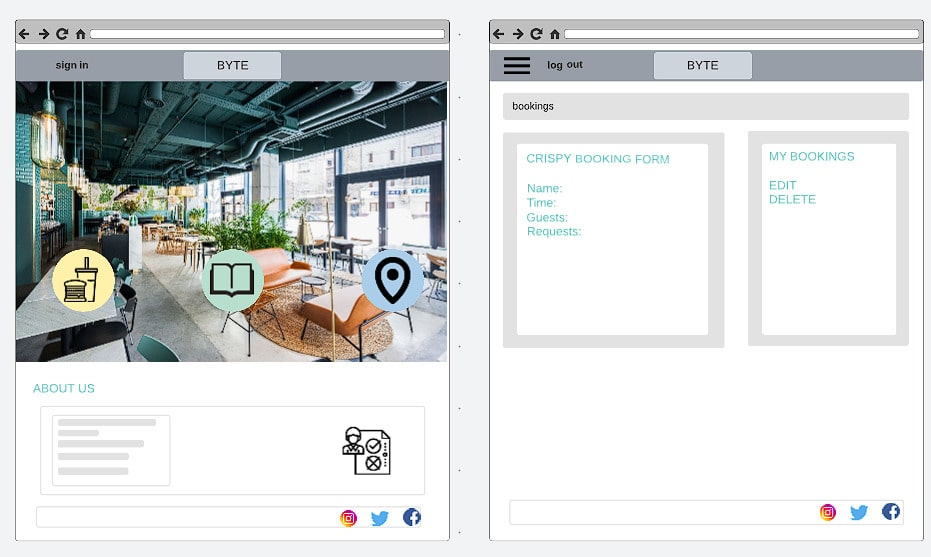
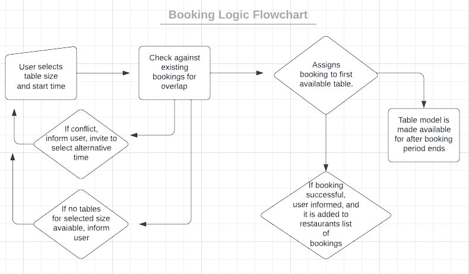

Project set-up

     cmnd:  django-admin startproject 'project name'.

    Adding apps for bookings and customers
        cmnd:   django-admin startapp 'app name'
        Register app names under installed_apps in settings.py

    Install allauth, refer to allauth documentation
        cmnd: pip3 install allauth
        Add lines 
                    # `allauth` needs this from django
                    'django.template.context_processors.request',
        under templates in settings.py
        Add lines
                    'django.contrib.sites',

                    'allauth',
                    'allauth.account',
                    'allauth.socialaccount',
        under installed_apps in settings.py
        Create section in settings above templates
                    AUTHENTICATION_BACKENDS = [
                    ...
                    # Needed to login by username in Django admin, regardless of `allauth`
                    'django.contrib.auth.backends.ModelBackend',

                    # `allauth` specific authentication methods, such as login by e-mail
                    'allauth.account.auth_backends.AuthenticationBackend',
                    ...
                    ]
        Under installed apps
                    SITE_ID = 1
        In urls.py
                    from django.urls import path, include
                    from django.conf import settings

                    urlpatterns = [
                        path('accounts/', include('allauth.urls')),
                    ]

        In .gitignore add
                    *.sqlite3
                    *.pyc
                    __pycache__

    cmnd: pip3 freeze > requirements.txt 
    to create a file for installed apps that can be summoned for local environment using cmnd: pip3 install -r requirements.txt

    To copy and paste folders and files from allauth site-packages first determine python version installed using cmnd: python --version In this case python3 3.8
    Create a folder, templates, and subfolder, allauth, from the project level directory
    Then run cmnd: cp -r ../.pip-modules/lib/python3.8/site-packages/allauth/templates/* ./templates/allauth/
    Delete openid and tests folders, as unneeded for this project, deleting will revert use to site_packages templates for same.

UX/UI

Example sites for restaurant home pages

Wireframes for project mock-up

Logic

Booking logic Flowchart

Plans for Models

Testing and Errors

    Errors

        1
        issue: Terminal prints: can't open file 'manage.py': [Errno 2] No such file or directory
        resolve: Correct capitalised occurrances of project name to lowercase to fit convention. Lifted project up a directory, rather than the folder of itself it was sat, bringing manage.py to the top level directory also.

Credits

Allauth set-up: https://django-allauth.readthedocs.io/en/latest/installation.html